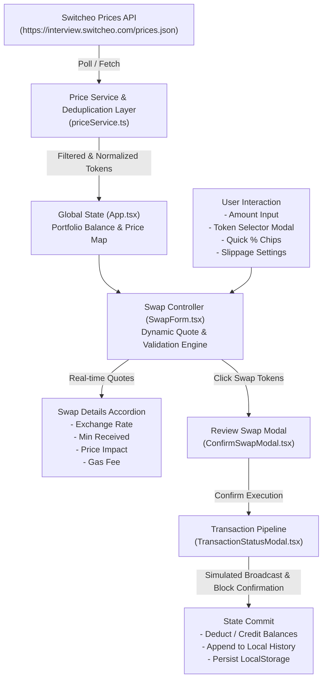

# Feature: Problem 1 - Interactive Currency Swap Form (NovaSwap)

## 1. End-to-End System Flow

The **NovaSwap** currency swap application facilitates asset exchanges across multiple cryptocurrency tokens through a streamlined, reactive frontend pipeline:



1. **Price Ingestion & Deduplication:**
   - On initial mount and recurring 60s intervals, `priceService.ts` queries the Switcheo live price endpoint.
   - The ingestion algorithm maps tokens by currency symbol, resolving duplicate entries by preserving only the latest ISO timestamp record with a valid positive price.
   - Token metadata (name, decimals, brand color, SVG icon URL) is attached.

2. **User Input, Fee Accounting & Real-Time Calculation:**
   - As the user types in `CurrencyInputCard`, the swap controller calculates the gross and net output amounts considering the **0.25% DEX liquidity provider / protocol trading fee**:
     $$\text{feeAmount} = \text{fromAmount} \times 0.0025$$
     $$\text{effectiveFromAmount} = \text{fromAmount} - \text{feeAmount}$$
     $$\text{grossToAmount} = \text{fromAmount} \times \left(\frac{\text{Price}_{\text{from}}}{\text{Price}_{\text{to}}}\right)$$
     $$\text{toAmount} = \text{effectiveFromAmount} \times \left(\frac{\text{Price}_{\text{from}}}{\text{Price}_{\text{to}}}\right)$$
   - Effective exchange rate and inverse rates incorporate the trading fee:
     $$\text{effectiveRate} = \frac{\text{toAmount}}{\text{fromAmount}} = \left(\frac{\text{Price}_{\text{from}}}{\text{Price}_{\text{to}}}\right) \times (1 - 0.0025)$$
   - Minimum received is derived from net output using the configured slippage tolerance:
     $$\text{minimumReceived} = \text{toAmount} \times \left(1 - \frac{\text{Slippage \%}}{100}\right)$$
   - **Comprehensive Validation Matrix:**
     - **Empty value:** Prompt "Enter an amount" (neutral disabled button).
     - **Zero or negative value:** Inline error "Amount must be greater than 0".
     - **Decimal precision:** Limits and validates decimal places according to `token.decimals` (e.g. max 6 for USDC, max 8 for WBTC, max 18 for ETH).
     - **Insufficient balance with Float Epsilon Safety:** Triggers inline error displaying exact available balance, highlights border red, and compares `parsedFromAmount > fromBalance + 1e-9` to avoid binary floating-point drift false positives.
     - **Same token selection:** Rejects identical source and destination tokens with "Source and target tokens must be different".
     - **Invalid slippage:** Validates that slippage tolerance is strictly between 0.01% and 50%.
     - **Missing price feed:** Detects tokens without valid price oracle data.
     - **Faucet / Balance Management:** Default mock balance allocated for 100% of tokens (~$10,000 USD each) with interactive **Faucet** button to top-up test funds anytime.

3. **Transaction Execution & State Persistence:**
   - When the user reviews and confirms the swap, the application enters an animated execution pipeline (broadcast $\rightarrow$ confirm).
   - Upon completion, the simulated blockchain receipt generates a unique transaction hash (`0x...`), updates mock wallet balances (`fromToken` reduced by `fromAmount`, `toToken` increased by `toAmount` net after fee), and stores the transaction in browser `localStorage`.
   - Balanced Cash Flow: In a round-trip swap ($5.5\text{ ETH} \rightarrow \text{USDC} \rightarrow \text{ETH}$), each leg cleanly incurs the $0.25\%$ fee so the final wallet balance reflects the actual net remaining asset ($5.5 \times (1 - 0.0025)^2 \approx 5.472534\text{ ETH}$). The user can fill the exact remaining balance via `MAX` without receiving false Insufficient Balance warnings.

---

## 2. Database & Schema Changes

While this challenge operates purely on the client-side with mock blockchain simulation, structured data schemas were established for runtime and persistence:

- **Token Model (`Token`):**
  ```typescript
  interface Token {
    symbol: string;
    name: string;
    price: number;
    date: string;
    decimals: number;
    iconUrl?: string;
    color?: string;
  }
  ```
- **Transaction Model (`Transaction`):**
  ```typescript
  interface Transaction {
    id: string;
    hash: string;
    fromSymbol: string;
    toSymbol: string;
    fromAmount: number;
    toAmount: number;
    fromUsd: number;
    toUsd: number;
    rate: number;
    timestamp: number;
    status: 'pending' | 'success' | 'failed';
  }
  ```
- **Persistence:**
  - `novaswap_user_balances_v1`: JSON dictionary storing token balances.
  - `novaswap_transactions_v1`: JSON array of historical swap records.

---

## 3. Technical Optimizations

- **Vite 6 & TypeScript Strict Mode:** Bundled using Vite ES modules with strict TypeScript checking (`noUnusedLocals`, `noUnusedParameters`), achieving a minified, gzipped bundle footprint (~59 kB JS, ~3.7 kB CSS).
- **Safe Numeric Parsing & Precision Handling:** Added `parseNumericInput` and `toCleanDecimalString` to eliminate JavaScript `parseFloat("9,052.64") === 9` delimiter truncation bugs, ensuring exact integer/float math when dealing with formatted thousand-separator strings.
- **Dust & Tiny Number Normalization (< $10^{-6}$):** Any residual micro-amounts or floating-point dust (e.g., `< 1e-6` / `...e-7`) resulting from repetitive conversions are automatically rounded/normalized to `= 0`, preventing awkward scientific notation displays (`4.0000e-7`) and ensuring clean `0.000000` balances.
- **Unified High-Precision Crypto Formatting:** Consolidated all number & balance displays into a flexible `formatCryptoAmount(val, maxDecimals, minDecimals)` helper, supporting exact 6-decimal fixed-width formatting for balances (`formatCryptoAmount(balance, 6, 6)`) and dynamic precision for swap amounts without code duplication.
- **Price Feed Timestamp Deduplication:** The Switcheo API returns multiple entries for identical currencies across different timestamps. The ingestion layer applies $O(N)$ dictionary deduplication to select the latest valid price.
- **Graceful Asset Image Fallback:** `TokenImage.tsx` automatically detects network/SVG loading failures and renders a stylized brand-colored monogram avatar without broken image icons.
- **Micro-animations & GPU Acceleration:** CSS transforms (`translateY`, `scale`, `rotate(180deg)`) and CSS variables ensure 60fps animations with hardware acceleration for cards, modals, and spinners.
- **Containerization:** Multi-stage `Dockerfile` with Alpine Node.js builder and Nginx production image for zero-dependency container deployment.

---

## 4. Impacted Files

| File | Type | Responsibility |
|------|------|----------------|
| `src/problem1/src/App.tsx` | New | Main application layout, global state, portfolio calculation, price polling. |
| `src/problem1/src/main.tsx` | New | React DOM mount entrypoint. |
| `src/problem1/src/types/token.ts` | New | Core TypeScript type definitions for tokens, quotes, and transactions. |
| `src/problem1/src/constants/tokens.ts` | New | Token metadata, initial balances, and popular token definitions. |
| `src/problem1/src/services/priceService.ts` | New | Live price fetching, fallback dataset, and timestamp deduplication. |
| `src/problem1/src/utils/formatters.ts` | New | Currency, crypto amounts, percentages, and hash formatters. |
| `src/problem1/src/styles/index.css` | New | Dark theme design tokens, glassmorphic styles, and animations. |
| `src/problem1/src/components/Header.tsx` | New | Navbar with Reset All Data button (with hover tooltip), portfolio balance, history & settings triggers. |
| `src/problem1/src/components/TokenImage.tsx` | New | Dynamic token icon loader with fallback avatar. |
| `src/problem1/src/components/TokenSelectModal.tsx` | New | Searchable token selector modal with popular chips. |
| `src/problem1/src/components/CurrencyInputCard.tsx` | New | Amount input, balance display, and quick percentage chips. |
| `src/problem1/src/components/SwapDetails.tsx` | New | Expandable accordion with rates, slippage, and fee breakdown. |
| `src/problem1/src/components/SlippageSettingsModal.tsx` | New | Custom slippage and transaction deadline settings. |
| `src/problem1/src/components/ConfirmSwapModal.tsx` | New | Order summary and final review before execution. |
| `src/problem1/src/components/TransactionStatusModal.tsx` | New | Transaction progress spinner and success receipt. |
| `src/problem1/src/components/TransactionHistoryModal.tsx` | New | Transaction history drawer with copy and explorer links. |
| `src/problem1/src/components/SwapForm.tsx` | New | Core swap state manager, form validations, and flip action. |
| `src/problem1/package.json` | New | Project dependencies and build scripts. |
| `src/problem1/vite.config.ts` | New | Vite configuration with React plugin. |
| `src/problem1/tsconfig.json` | New | TypeScript compiler configuration. |
| `src/problem1/Dockerfile` | New | Multi-stage Docker production build with Nginx runner. |
| `src/problem1/Dockerfile.dev` | New | Development container with live hot reload support. |
| `src/problem1/docker-compose.yml` | New | Problem-level container orchestration. |
| `src/problem1/docker-compose.dev.yml` | New | Problem-level live development compose config. |
| `src/problem1/nginx.conf` | New | Nginx server config with SPA fallback, gzip, and security headers. |
| `docker-compose.yml` | New | Root-level Docker Compose orchestrator. |
| `src/problem1/README.md` | Modified | Problem documentation, feature walkthrough, and setup instructions. |
| `docs/features/problem1-fancy-form.md` | New | Dedicated feature technical documentation file. |
