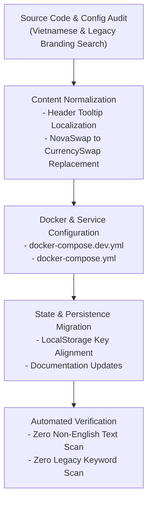

# Feature: Codebase Localization & Branding Standardization (translate-to-english)

## 1. End-to-End System Flow

This task completed a full codebase audit and refactoring to standardize all user-facing content, documentation, Docker container labels, service identifiers, and UI copy:

1. **Localization to Standard English:**
   - Identified and translated the remaining Vietnamese text in the UI (Data Reset Tooltip inside `src/problem2/src/components/Header.tsx`) to standard, clean English.
2. **Branding Normalization (NovaSwap $\rightarrow$ CurrencySwap):**
   - Replaced all legacy references to `novaswap` / `NovaSwap` with the unified project identity `CurrencySwap` across:
     - `src/problem2/docker-compose.dev.yml` (service and container names)
     - `src/problem2/docker-compose.yml` (production service and container names)
     - `src/problem2/README.md` (image alt tag and documentation)
     - `src/problem2/src/App.tsx` (localStorage cleanup keys)
     - `docs/features/problem2-fancy-form.md` (feature title, introduction, and persistence keys)
3. **Automated Zero-Tolerance Verification:**
   - Performed automated regex scans across all file types (`.ts`, `.tsx`, `.md`, `.json`, `.yml`, `.html`, `.css`), confirming 0 remaining Vietnamese characters and 0 legacy `NovaSwap` references.

---

## 2. Database & Schema Changes

N/A (No database or schema structure changes were introduced in this localization and branding task).

---

## 3. Technical Optimizations

- **Container & Compose Naming Consistency:** Updated Docker Compose service and container identifiers to match the project branding (`problem2-currencyswap`, `problem2-currencyswap-dev`), eliminating confusion during container orchestration.
- **Clean Persistence Migration:** Aligned localStorage cleanup in `App.tsx` to handle `currencyswap_transactions_v2` and cleanly clear legacy keys.

---

## 4. Impacted Files

| File | Type | Responsibility |
|------|------|----------------|
| `src/problem2/src/components/Header.tsx` | Modified | Localized the reset data tooltip into standard English. |
| `src/problem2/docker-compose.dev.yml` | Modified | Renamed dev service to `currencyswap-dev` and container to `problem2-currencyswap-dev`. |
| `src/problem2/docker-compose.yml` | Modified | Renamed prod service to `currencyswap-prod` and container to `problem2-currencyswap`. |
| `src/problem2/README.md` | Modified | Updated preview alt text to `CurrencySwap`. |
| `src/problem2/src/App.tsx` | Modified | Cleaned up localStorage key references. |
| `docs/features/problem2-fancy-form.md` | Modified | Standardized documentation branding to `CurrencySwap`. |
| `docs/features/translate-to-english.md` | New | Technical documentation for the localization and branding task. |
